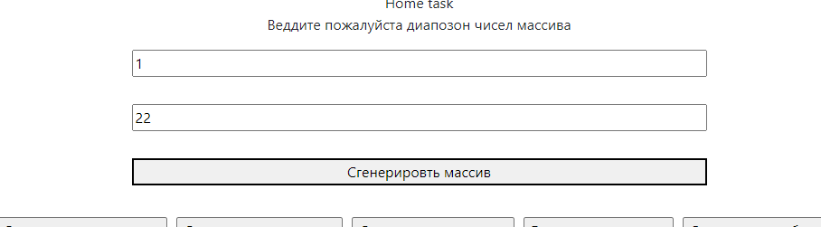
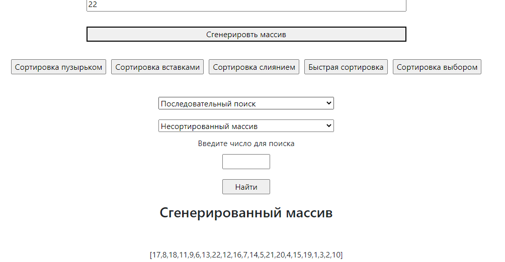
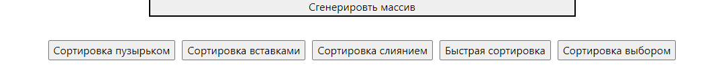
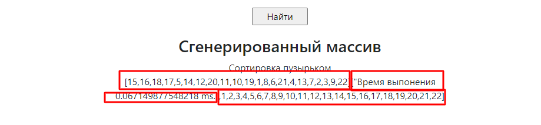
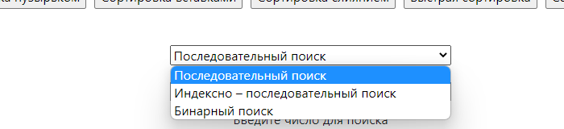
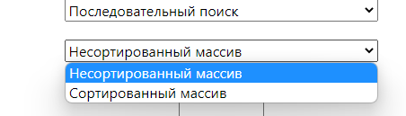
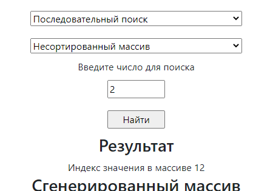

Седьмое задание сортировка массивов и алгоритмы поиска.

В индексной странице создал поля воода для геннераци произольного массива 

ajax-ом передаю введённые значения в файл generate_array.php в папке ajax в нём проверяю что пришло в массве post
присваиваю занчения из input переменным вызваю метод setArray в предварительно созданном классе SortClass.php
 метод генерирует упордоченный массив из указанных входных параметров и возврашет назад вфайл generate_array дальше 
 встроенной функцией php shuffle() массив рандомно перемешиваю и возвращаю.
 
 Далее в index page создал кнопки сортировки  
 
 При клике по соответствуйющей кнопке аяксом также передаются значения инпутов и тип сортировки в файл generate_array.php
 где проверяется что пришло массиве пост и вызывается соотвестно метод из класса SortClass полученный результат
 передаю в файл script.js и он соответсвенно отрисовывает результат на странице 
  

Методы поиска.
Для методов поиска создал предварительно класс SearchClass и файл обработки ajax search.php
В index page сделал выпадающий список с возможностью выбора метода поиска и типа сортировки

и полем ввода искомого значения

Не разобрался только с индексно-последовательном поиске...